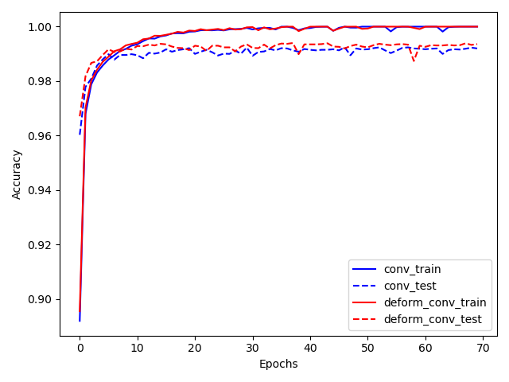

# Deformable convnet

## Requirement
tensorflow==1.2.1

## Result on minist

## Time comparision
* time unit: ms
* input size: (batch, width, height, channel)=[100,28,28,1]
* test on GeForce GTX 1050 Ti

|  item   | conv  | deform_conv  |
|  :----:  | :----:  | :----:  | 
| train  | 0.0095 | 0.4685 |
| test | 0.0037 | 0.3962 |

## Reference
Main code comes from [Here](https://github.com/maestrojeong/deformable_convnet)
